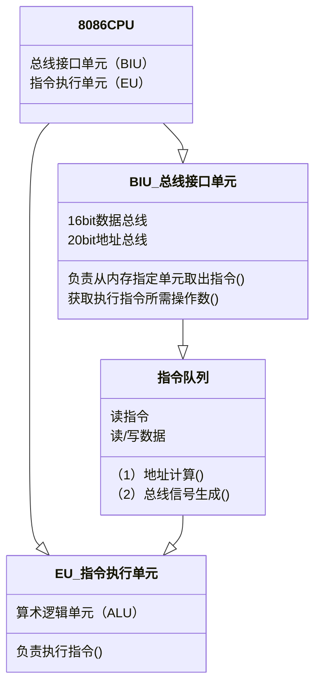
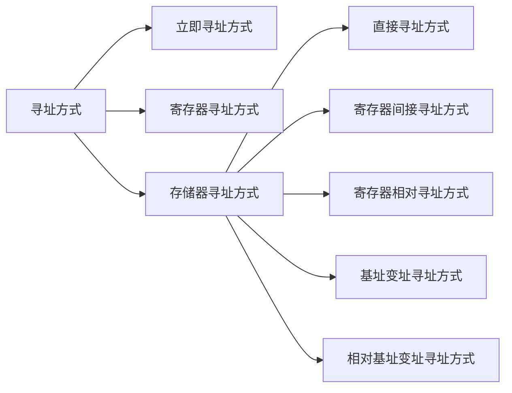
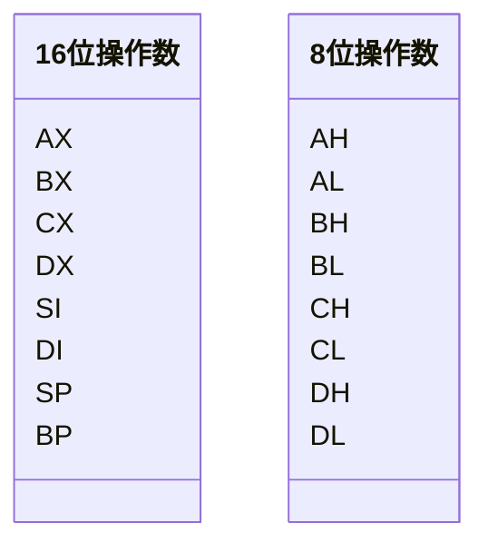
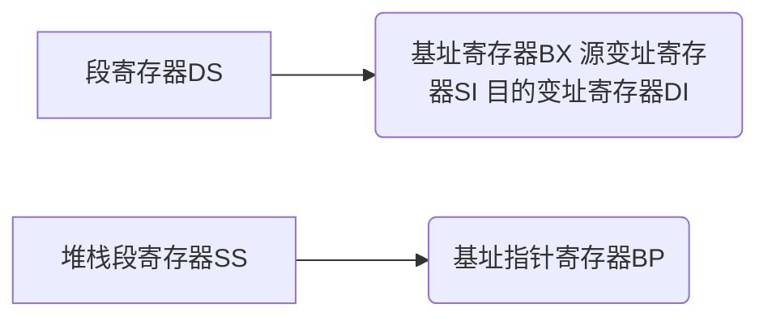
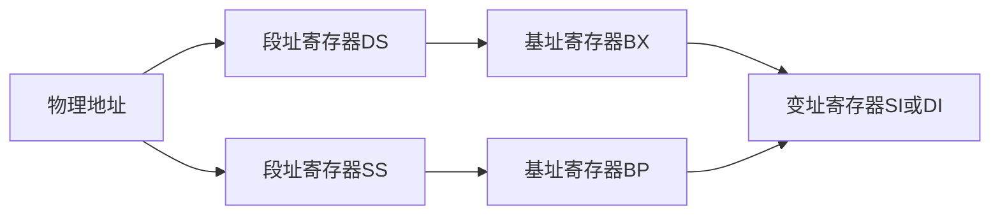

# 微机原理


## 第二章 ==微处理器==的结构和工作模式

### 2.1 **8086**CPU的内部结构和存储器结构

#### 2.1.1 内部结构

由总线接口单元（BIU）和指令执行单元（EU）两部分组成。



#### 2.1.2 工作过程

1. 读存储器操作

   根据现行段地址寄存器CS和指令指针寄存器IP的值，在地址加法器$\sum$中形成20位物理地址：
   $$
   CS\times16(左移4位)+IP
   $$

#### 2.2.3 CPU内部寄存器

##### 1.数据寄存器

|      | 15   | 7    | 用途           | 功能                                       |
| ---- | ---- | ---- | :------------- | ------------------------------------------ |
| AX   | AH   | AL   | ==累加器==     | 使用最多、最频繁；在**乘除法**中有专门用途 |
| BX   | BH   | BL   | ==基址==寄存器 | 存放**偏移地址**                           |
| CX   | CH   | CL   | ==计数==寄存器 | 在循环操作时作**计数器**                   |
| DX   | DH   | DL   | ==数据==寄存器 | 在**乘除法88**和**I/O口**的操作中使用      |

##### 2.段寄存器

8086/8088CPU可直接寻址**1MB**的存储空间，需要20位地址信息。

CPU内部寄存器只有16位，因此采用**分段**技术解决，将1MB存储空间分成若干个**逻辑段**，每段长**64KB（16位）**。

| 段寄存器 |              |
| -------- | ------------ |
| CS       | 代码段寄存器 |
| DS       | 数据段寄存器 |
| SS       | 堆栈段寄存器 |
| ES       | 附加段寄存器 |

存放各段起始地址的**高16位值**。

##### 3. 地址指针和变址寄存器

| 地址指针和变址寄存器 |                |
| -------------------- | -------------- |
| SP                   | 堆栈指针寄存器 |
| BP                   | 基址指针寄存器 |
| SI                   | 源变址寄存器   |
| DI                   | 目的变址寄存器 |

存放段内地址偏移量（Offset）。

段基地址和段内偏移地址Offset组合得到20位物理地址。

##### 4.标志寄存器

| 标志位寄存器 |                |                                                              |
| ------------ | -------------- | ------------------------------------------------------------ |
| 0            | 进位标志CF     |                                                              |
| 2            | 奇偶校验位PF   | 也称**偶校验位**                                             |
| 4            | 辅助进位标志AF | 低4位向高4位借位或有进位，只在**BCD**码计算才有用，需要==减6调整== |
| 6            | 零标志ZF       |                                                              |
| 7            | 符号标志SF     |                                                              |
| 11           | 溢出标志OF     |                                                              |
| 8            | 陷阱标志TF     | TF=1，==单步工作==模式；TF=0，正常运行                       |
| 9            | 中断标志IF     | IF=1，运行CPU响应可**屏蔽中断**；执行STI指令可使IF置1，CLI指令使IF清0。 |
| 10           | 方向标志DF     |                                                              |

+ 正数/负数/BCD数由编程人员确定

+ 有符号数，查SF、OF

+ 无符号数，查CF

+ BCD数，查AF

+ 均查ZF、PF

##### 5.指令指针寄存器IP

程序运行时，每次CPU从代码段取出1字节指令，IP++。

IP值仅能由**BIU**自动修改，不能人为更改。


## 第三章 8086的寻找方式和指令系统

### 3.1 8086的寻址方式




#### 3.1.1 立即寻址方式

==立即数==：操作数直接包含在指令中的**8位**或**16位**的常数。

立即数只能作为**源操作数**，不能作为**目的操作数**。


#### 3.1.2 寄存器寻址方式

操作数包含在**寄存器**中，由**指令**指定寄存器。



#### 3.1.3 存储器寻址方式

##### 1. 直接寻址方式

1. 直接寻址方法

   ==有效地址==：操作数的**偏移地址**称为有效地址。

   有效地址必须加上**方括号**，与立即数区分。

   默认使用的**段寄存器**为数据段寄存器DS。

   ```mermaid
   flowchart LR
   直接寻址方法-->id1(默认使用数据段寄存器DS)-->id3(操作数的物理地址=16XDS+EA)
   直接寻址方法-->id2(有效地址EA)-->id3(操作数的物理地址=16XDS+EA)
   ```

2. 段超越前缀

   对代码段、堆栈段和附加段寄存器所指出的存储器进行直接寻址，需要指出**段超越前缀**。

   ```mermaid
   flowchart LR
   直接寻址方法-->id1(指定数据段寄存器 以ES为例)-->id3(操作数的物理地址=16XES+EA)
   直接寻址方法-->id2(有效地址EA)-->id3(操作数的物理地址=16XES+EA)
   ```

   $MOV\quad AX,ES:[500H]$，使用符号**“：”**。

3. 符号地址

   ```mermaid
   flowchart LR
   EQU-->给常数定义符号名
   DW-->给变量定义符号名
   ```

##### 2.寄存器间接寻址方式

指令给出操作数的有效地址，寄存器名称外必须加**方括号**。

段寄存器和指令寄存器的对应关系：



例如：
$$
MOV \quad BX, DS:[BP]\\
MOV \quad AX, ES:[SI]
$$

##### 3 寄存器相对寻址方式

在**寄存器间接寻址方式**的基础上，在等效地址上加一个**位移量**。例如：
$$
MOV\quad BX,COUNT[SI]\\
MOV \quad AH, ES:ARRAY[SI]
$$

##### 4.基址变址寻址方式

**有效地址**是一个**基址寄存器**和一个**变址寄存器**的内容之和。



##### 5 相对基址变址寻址方式

##### PS：指令中的方括号[]

